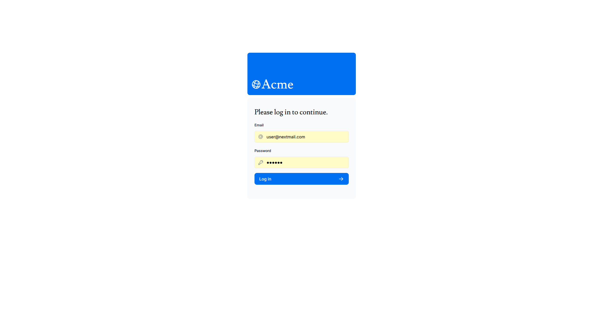
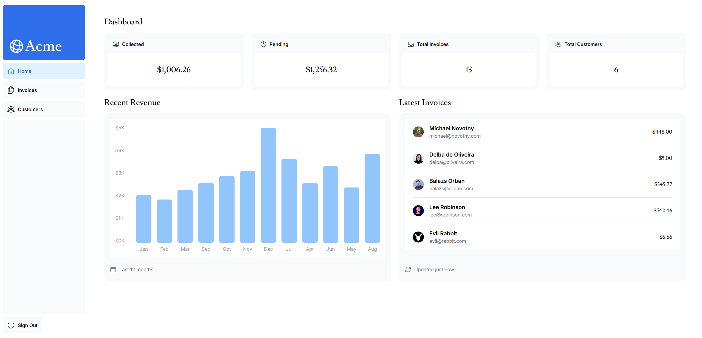
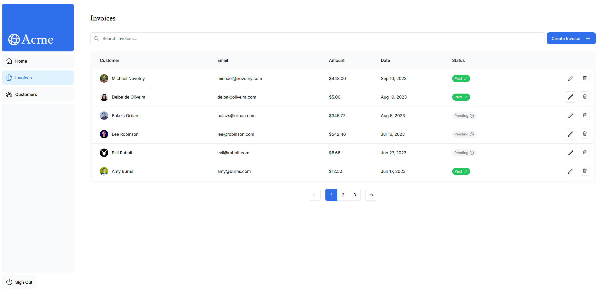
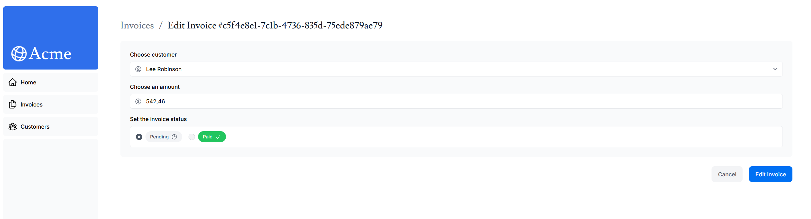

# Next.js Dashboard

A fullstack dashboard application built with Next.js App Router.

The project includes authentication, invoice management, customer pages, dynamic metadata, search functionality, and responsive dashboard UI.

This application was created as a practice project for improving fullstack development skills with the modern Next.js ecosystem.

---

## Features

- Authentication with NextAuth
- Dashboard overview page
- Invoice management
- Customer management
- Search and pagination
- Dynamic routing
- Dynamic metadata and SEO
- Responsive UI
- Server Components
- TypeScript support

---

## Tech Stack

- Next.js
- React
- TypeScript
- Tailwind CSS
- PostgreSQL
- NextAuth.js
- ESLint
- PNPM

---

## Screenshots

### Login Form

---

### Dashboard

---

### Invoices Page

---

### Invoice Editing

---

## Getting Started

Install dependencies:

pnpm install

Run development server:

pnpm dev

Open in browser:

http://localhost:3000

---

## Environment Variables

Create a `.env.local` file:

AUTH_SECRET=your_secret
DATABASE_URL=your_database_url

---

## Learning Goals

This project was created to practice:

- Next.js App Router
- Server Actions
- Authentication and authorization
- Fullstack React architecture
- SEO and metadata generation
- Database integration
- TypeScript in production applications

---

## Additional Improvements

Compared to the original starter project:

- Authentication configured
- Metadata improvements
- ESLint setup
- Improved routing structure
- UI refinements
- Project structure cleanup

---

## Live Demo

https://next-cyan-beta-99.vercel.app/
